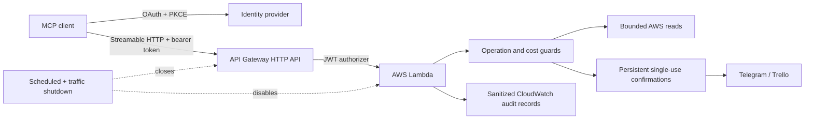

# AWS Remote MCP

[](https://github.com/herrerogusano/aws-remote-mcp/actions/workflows/ci.yml)

An authenticated Model Context Protocol server for AWS, deployed with a
closed-by-default serverless architecture. It combines bounded AWS inventory,
explicitly confirmed external actions, OAuth resource binding, least-privilege
IAM, audit records, and technical cost controls.

The project is designed as a production-shaped portfolio system: normal CI is
offline, live environments remain disabled outside short validation windows,
and every claim below is tied to recorded evidence rather than an always-open
public endpoint.

## What this project demonstrates

- Current MCP Streamable HTTP transport on AWS Lambda and API Gateway.
- OAuth/OIDC bearer authorization with exact issuer, audience, scope, and
  protected-resource metadata contracts.
- Bounded AWS inventory through Lambda, API Gateway v2, Resource Explorer, and
  CloudFormation-owned resource discovery.
- Cost Explorer behind a five-minute, payload-bound confirmation and a maximum
  of three request attempts per UTC month.
- Telegram and Trello writes protected by persistent, expiring, single-use
  confirmation state.
- Closed-by-default infrastructure, independent shutdown controls, sanitized
  audit logs, locked dependencies, and offline CI.

## Architecture



DEV and PROD are isolated. Both API execution and Lambda concurrency are off by
default. A live validation window is optional, lasts at most five minutes, and
arms scheduled and request-volume shutdown paths before execution is enabled.

## Tool surface

| Capability | Default posture | Boundaries |
| --- | --- | --- |
| Diagnostics | Local and remote | Sanitized health and configuration only |
| AWS inventory | Read-only | Fixed services, regions, page counts, result limits, and no SDK retries |
| Resource search | Disabled by default | One existing Resource Explorer view, one page, at most 50 sanitized results |
| Cost query | Disabled by default | Exact payload confirmation, one request, no pagination, global monthly quota |
| Telegram / Trello | Disabled by default | Fixed destinations, persistent one-use confirmation, one attempt, no blind retry |

The local profile uses deterministic fixtures and never contacts AWS or an
external provider.

## Verified evidence

- A real authorization-code + PKCE + TOTP flow produced a resource-bound access
  token and completed MCP tool discovery and bounded calls.
- Real AWS inventory validation completed with two SDK reads, ten sanitized
  resources, zero writes, and independently verified shutdown.
- One confirmed Telegram message and one confirmed Trello card were validated
  through direct Lambda invocation while the public API remained disabled.
- CloudWatch received exact-schema audit records without tokens, payloads,
  account IDs, full ARNs, or provider responses.
- The isolated PROD stack is deployed with no users, no provider credentials,
  and execution disabled.

The WorkOS multi-client profile is implemented as a target for CIMD/DCR client
onboarding, but its staging configuration and live client validation remain
pending. It is not counted as completed evidence.

See the [demonstration guide](docs/demo.md),
[validation evidence](docs/direct-validation-evidence.md), and
[current project status](docs/project-status.md).

## Quick local demo

Requirements: Python 3.13 and [uv](https://docs.astral.sh/uv/).

```bash
uv sync --locked --all-groups
uv run aws-remote-mcp
```

The server binds only to `127.0.0.1:8000` and exposes MCP at
`http://127.0.0.1:8000/mcp`. A compatible local client can discover:

- `diagnostico`
- `listar_inventario_aws`
- `buscar_recursos_aws`
- `preparar_mensaje_telegram`
- `preparar_tarjeta_trello`

Execute/send/create tools are intentionally absent from the default local
profile. See [external integrations](docs/external-integrations.md) for the
remote confirmation contract.

## Quality gates

```bash
uv run ruff format --check .
uv run ruff check .
uv run mypy
uv run pytest
sam validate --lint --region eu-west-1
sam build --beta-features
```

Pull requests and pushes to `develop` or `main` run the same checks without AWS,
OAuth, Telegram, Trello, or paid-service calls.

## Security and cost posture

- No static cloud or provider credentials in source control or CI.
- Least-privilege inline IAM derived from the reachable operations.
- Tokens are removed before the MCP application is constructed.
- Confirmations are bound to caller, action, normalized payload, and expiry.
- Ambiguous external-write outcomes are never retried automatically.
- AWS Budgets is treated as delayed alerting, not as a hard spending cap.
- The API, compute, traffic alarm, and automatic-close schedule are audited
  after each validation window.

Detailed reasoning is available in the [architecture](docs/architecture.md),
[threat model](docs/threat-model.md), [cost controls](docs/cost-safety.md), and
[authorization contract](docs/authorization-contract.md).

## Branch and environment model

```text
feature/* -> develop -> DEV
              |
              +---- reviewed promotion -> main -> PROD
```

Infrastructure changes, live validation, paid reads, and provider writes remain
explicitly gated operational actions. The repository is fully demonstrable
without opening the remote endpoint.
